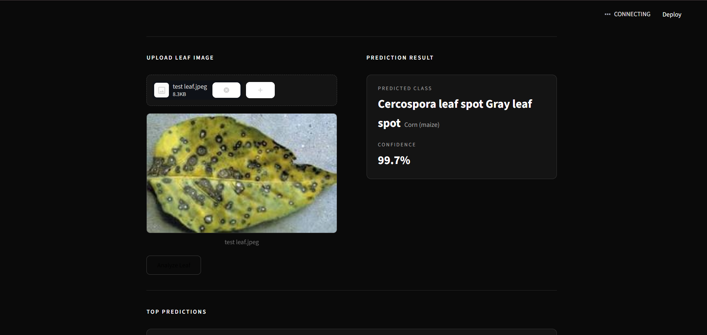
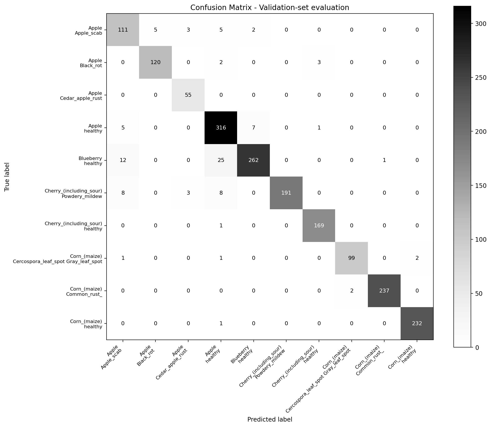
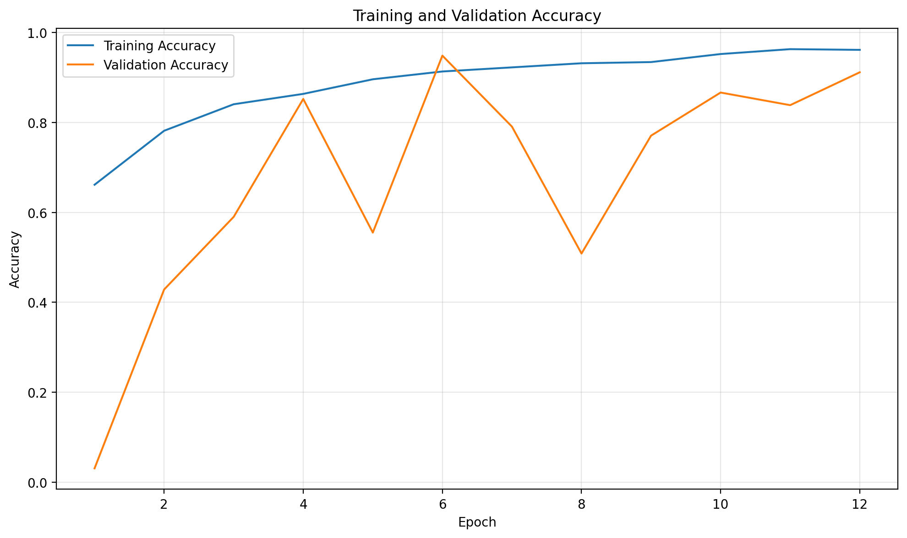
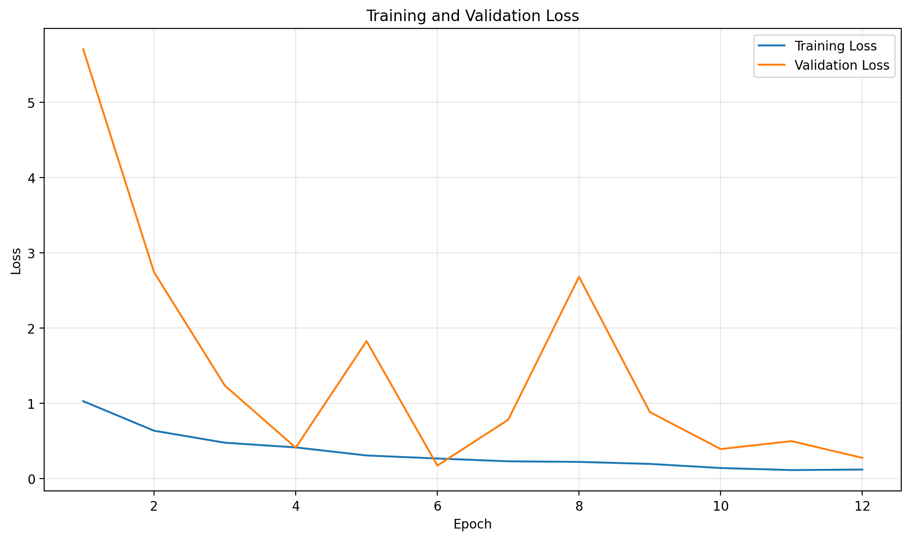

# Plant Disease Detection Using Convolutional Neural Network

A deep learning-based plant disease detection system that classifies plant leaf images into 10 different disease and healthy classes using a Convolutional Neural Network (CNN).

## Project Overview

Plant diseases can significantly affect crop productivity and quality. This project uses a CNN built with TensorFlow/Keras to automatically classify plant leaf images into predefined disease or healthy categories.

The project includes
- CNN-based image classification
- PlantVillage dataset
- Image preprocessing and augmentation
- Class-weighted training
- Early stopping and learning-rate reduction
- Model evaluation using multiple classification metrics
- Confusion matrix visualization
- Streamlit-based prediction interface

## Classes

The model currently supports 10 classes:

1. Apple Apple Scab
2. Apple Black Rot
3. Apple Cedar Apple Rust
4. Apple Healthy
5. Blueberry Healthy
6. Cherry Powdery Mildew
7. Cherry Healthy
8. Corn Cercospora Leaf Spot / Gray Leaf Spot
9. Corn Common Rust
10. Corn Healthy

## Dataset

The project uses an existing PlantVillage-based dataset containing:

- **Training images:** 7,556
- **Validation images:** 1,890
- **Number of classes:** 10
- **Image size:** 128 × 128 during model training

The dataset is not included in this repository because of its size.

Place the dataset locally using the following structure:

```text
PlantVillage_15/
├── train/
│   ├── Apple___Apple_scab/
│   ├── Apple___Black_rot/
│   ├── ...
│
└── val/
    ├── Apple___Apple_scab/
    ├── Apple___Black_rot/
    ├── ...

    CNN Architecture
The model uses a convolutional neural network with:
- Data augmentation
- Rescaling
- 4 convolutional blocks
- Batch normalization
- ReLU activation
- Max pooling
- Dropout
- Global Average Pooling
- Dense layer
- Softmax output layer
The model was trained using:
- Optimizer: Adam
- Loss: Categorical Crossentropy
- Batch size: 32
- Maximum epochs: 30
- Input size: 128 × 128 × 3
Training
Training includes:
- Class weights to handle class imbalance
- EarlyStopping
- ReduceLROnPlateau
- ModelCheckpoint
The best trained model is saved as:
model/plant_cnn.keras

Results
The best model achieved the following validation-set results:
Metric	Score
Accuracy	94.81%
Macro Precision	94.63%
Macro Recall	95.27%
Macro F1-Score	94.85%
Weighted Precision	95.10%
Weighted Recall	94.81%
Weighted F1-Score	94.85%


Important: These are validation-set results. The validation set was used during training for model selection through EarlyStopping and ModelCheckpoint, so these results should not be interpreted as results from an independent test set.
Evaluation
The project generates:
- Classification report
- Accuracy
- Precision
- Recall
- F1-score
- Confusion matrix
- Training accuracy graph
- Training loss graph
Generated evaluation files are stored in:

## Application Screenshots

### Streamlit Home Page



### Prediction Result


## Model Evaluation

### Confusion Matrix



### Training Accuracy



### Training Loss


results/
├── classification_report.txt
├── evaluation_metrics.json
├── history.json
├── confusion_matrix.png
├── training_accuracy.png
└── training_loss.png

Streamlit Application
A Streamlit application is included for interactive plant disease prediction.
The application allows users to:
1. Upload a plant leaf image
2. Preview the image
3. Analyze the image using the trained CNN
4. View the predicted class
5. View the prediction confidence
6. View the top predictions
Run the application using:
python -m streamlit run app.py

Project Structure

Plant-Disease-Detection-CNN/
│
├── model/
│   ├── class_names.json
│   └── plant_cnn.keras
│
├── results/
│   ├── classification_report.txt
│   ├── confusion_matrix.png
│   ├── evaluation_metrics.json
│   ├── history.json
│   ├── training_accuracy.png
│   └── training_loss.png
│
├── app.py
├── train.py
├── evaluate.py
├── inspect_data.py
├── main.tex
├── sample_architecture.png
├── college_logo.png
├── samplebib.bib
├── .gitignore
└── README.md

Installation
Clone the repository:
git clone https://github.com/dwarakeshgit/Plant-Disease-Detection-CNN.git
cd Plant-Disease-Detection-CNN

Install the required Python packages:
pip install tensorflow streamlit numpy matplotlib scikit-learn

Make sure the existing PlantVillage dataset is placed in:
PlantVillage_15/

with the required train and val folders.
Running the Project
Inspect the Dataset
python inspect_data.py

Train the CNN
python train.py --train

Evaluate the Model
python evaluate.py

Run the Streamlit Application
python -m streamlit run app.py

Technologies Used
- Python
- TensorFlow
- Keras
- NumPy
- Scikit-learn
- Matplotlib
- Streamlit
- PlantVillage Dataset